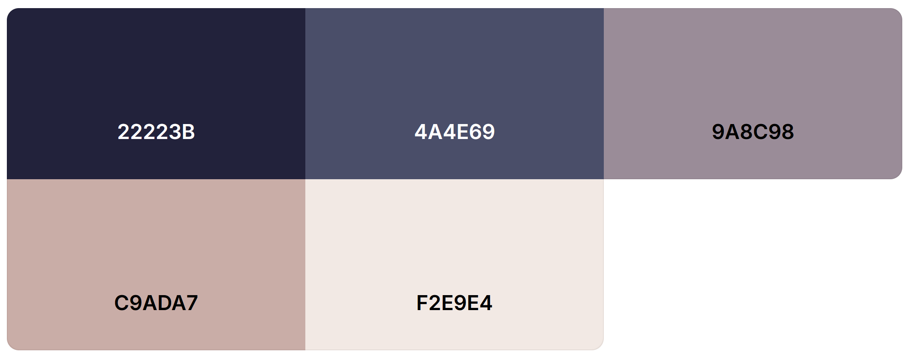

# Portfolio Babski Florian
## Charte graphique :

## Lien de la page :
https://babskiflorian.github.io/Portfolio-Babski-Florian

# Mon Portfolio Personnel

Bienvenue sur mon portfolio en ligne ! Ce site a été conçu pour vous donner un aperçu de mon parcours professionnel, de mes compétences et de mes projets.

## Navigation

Le portfolio est structuré en quatre sections principales :

* **Accueil :** Une brève introduction à mon profil, mes objectifs et mes compétences clés.
* **Projets :** Une vitrine de mes réalisations, avec des descriptions détaillées et des liens vers les projets en ligne ou les dépôts GitHub.
* **CV :** Mon curriculum vitae à jour, disponible en téléchargement.
* **Contact :** Mes coordonnées et un formulaire de contact pour me joindre facilement.

## Technologies Utilisées

* [HTML, CSS, JavaScript] 

## Comment Explorer le Portfolio

* **Accueil :** Commencez par la page d'accueil pour une vue d'ensemble rapide de qui je suis et de ce que je fais.
* **Projets :** Explorez la section "Projets" pour découvrir mes réalisations et les technologies que j'ai utilisées.
* **CV :** Téléchargez mon CV pour un aperçu détaillé de mon expérience et de mes compétences.
* **Contact :** N'hésitez pas à me contacter via le formulaire ou les liens fournis si vous avez des questions ou des opportunités à me proposer.

